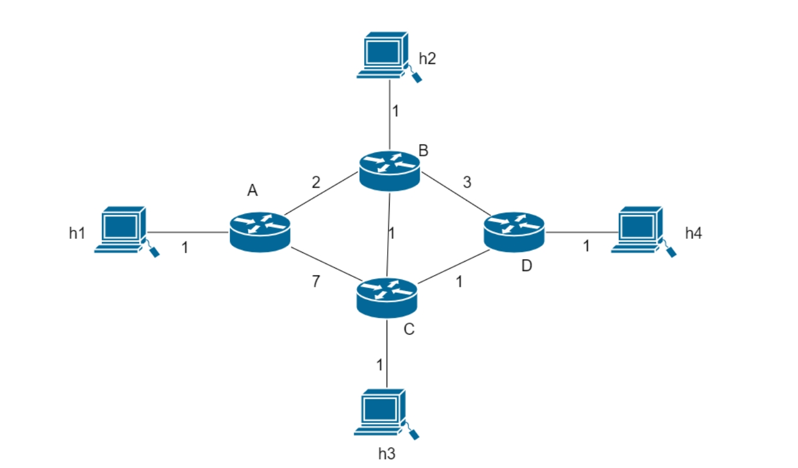

# 实验笔记

## 代码使用方法
1. 构建了一个新的拓扑图`RIP\cs168_proj_routing_student-master\simulator\topos\duozhi.py`


2. 在command line中运行`python simulator.py --start --default-switch-type=dv_router topos.duozhi`

3. 运行后`h1.ping(h4)`。

4. 得到输出：

`DEBUG:user:h4:rx: <Ping h1->h4 ttl:15> sa,sb,sc,sd,h4`

`DEBUG:user:h1:rx: <Pong <Ping h1->h4 ttl:15>> sd,sc,sb,sa,h1`

5. 如果要进行berkeley project中的测试的话。则在command line中输入`python.exe .\dv_unit_tests.py 10`。

6. 得到：
```
Ran 31 tests in 0.086s

FAILED (failures=4)

Overall scores:
        Stage 1 TestStaticRoutes                   :  1 / 1  passed
        Stage 2 TestForwarding                     :  4 / 4  passed
        Stage 3 TestAdvertise                      :  1 / 1  passed
        Stage 4 TestHandleAdvertisement            :  8 / 8  passed
        Stage 5 TestRemoveRoutes                   :  4 / 4  passed
        Stage 6 TestSplitHorizon                   :  1 / 1  passed
        Stage 7 TestPoisonReverse                  :  1 / 1  passed
        Stage 8 TestInfiniteLoops                  :  3 / 3  passed
        Stage 9 TestRoutePoisoning                 :  5 / 5  passed
        Stage 10 TestTriggeredIncrementalUpdates    : 27 / 31 passed (4 FAILED)

Total score: 98.71 / 100.00

```
## Stage 1/10: Static Routes
初始化静态路由，通过将直接连接到主机的路由器将主机信息添加为静态路由到路由表中。创建一个新的 TableEntry，具体实现可以查看 dv.py 中的类定义，遵循实验文档中指定的参数。

## Stage 2/10: Forwarding
转发有效数据包，通过检查路由表中是否存在目标条目来实现。如果找到，则转发数据包；否则，丢弃。此处的延迟指的是从当前路由器到目的地的延迟，如果超过 INFINITY，则无需转发。

## Stage 3/10: Sending Routing Tables Advertisements
持续向相邻路由器转发自己的路由以更新它们的路由表。实现发送路由的函数，重点在于处理 force=True 的情况，即转发所有路由。

## Stage 4/10: Handle Route Advertisements
处理路由广告，按照文档中提供的逻辑。注意，如果新的延迟与旧的相同，则无需更新。

## Stage 5/10: Handling Routing Tables Timeouts
处理路由表的超时情况，根据 expire_time 删除过期的路由。考虑到延迟和网络连接的变化，路由也有时间限制。

## Stage 6/10: Split Horizon (Let’s Get Loopy)
防止网络中连接断开时产生无限循环。对于每个路由，如果由端口 port 更新，则在广告时避免从此端口发送数据包。然而，在大于两的循环中可能会出现潜在的无限转发问题，要谨慎处理。

## Stage 7/10 Poison Reverse (Still loopy)
解决持续存在的不良路由，而不是停止转发，而是发送一个毒性路由来快速消除该路由的影响。

## Stage 8/10: Counting to Infinity
处理路由器形成环路且实际连接到主机的情况。设置延迟的大门限值（INFINITY），当延迟计数达到无穷时，丢弃数据包。具体逻辑细节请参阅文档。

## Stage 9/10: Poisoning Expired Routes
通过类似于毒性逆转的方法，投毒处理过期的路由，以改善收敛时间。

## Stage 10/10: Becoming Eventful
通过维护一个记录最新目标和端口的数据结构来优化路由器。当 force=False 时，仅转发发生变化的路由。在添加或删除连接时，相应地转发路由。最后按直觉优化了一下，发现缺了几个报文，也懒得写了。